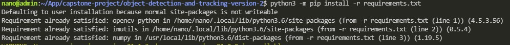
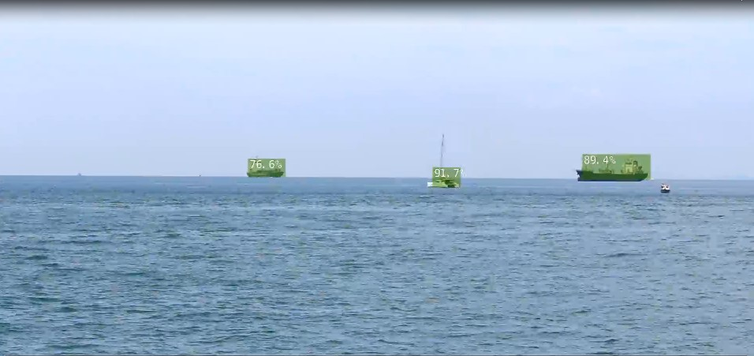
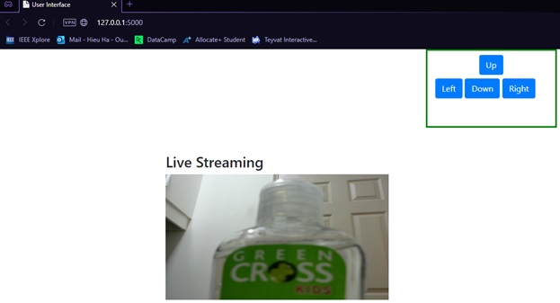

<p align="center">
  <a href="" rel="noopener">
</p>

<h3 align="center">Ojbect Detection and Tracking for Autonomous Surface Vehicle(ASV)</h3>

<div align="center">

[]()
[](https://github.com/kylelobo/The-Documentation-Compendium/issues)
[](https://github.com/kylelobo/The-Documentation-Compendium/pulls)

</div>

--- 
</p>

## 📝 Table of Contents

- [About](#about)
- [Getting Started](#getting_started)
- [Deployment](#deployment)
- [Usage](#usage)
- [Built Using](#built_using)
- [TODO](../TODO.md)
- [Contributing](../CONTRIBUTING.md)
- [Authors](#authors)
- [Acknowledgments](#acknowledgement)

## 🧐 About <a name = "about"></a>

Welcome to object detections and tracking for the Autonomous Surface Vehicle (ASV) model in Capstone Project. Deep learning model from [Jetson Inference library](https://github.com/dusty-nv/jetson-inference) are used on the Jetson Nano hardware. Also the communication with the desktop and Jetson Nano remotely.

## 🏁 Getting Started <a name = "getting_started"></a>

These instructions will get you a copy of the project up and running on your local machine for development and testing purposes. See [deployment](#deployment) for notes on how to deploy the project on a live system.

### Prerequisites

What things you need to install the software and how to install them.

```
opencv-python
imutils
numpy
```

#### IMPORTANT 
<b>You should install Jetson package follows by Nvidia before proceed to the next step!! </b>
Download [deep learning model tutorial](https://github.com/dusty-nv/jetson-inference/blob/master/docs/building-repo-2.md#downloading-models).

Full tutorial [here](https://developer.nvidia.com/blog/realtime-object-detection-in-10-lines-of-python-on-jetson-nano/).

### Installing

A step by step series of examples that tell you how to get a development env running.

Say what the step will be

```
# If you are using ubuntu, mac or linux
python3 -m pip install -r requirements.txt

# If you are using window
python -m pip install -r requirements.txt
```

</a>
This should be the output if all your package is installed.

## 🔧 Running the tests <a name = "tests"></a>

Explain how to run the automated tests for this system.

### Object detections and tracking

To run the object detections on a video, run this code below.

```
cd object-detection-n-tracking/

python3 main.py `your-video-path` `your-output` 
```
The result should be similiar to this result.

</a>


To run the object detections on your webcam, run this code below.

```
cd object-detection-n-tracking/

python3 main.py
```


### Web socket control through Wi-Fi

Run the code below in the following order to run the communication.

```
python3 server.py
```
</a>


Open another terminal, and run the code below.

```
# go the the folder frontend
cd frontend/

python3 main.py
```
</a>


<b> Notes: </b> Make sure the camera is turn on before proceed the code above.  

## 🎈 Usage <a name="usage"></a>

This code will helps you to detect object and track one object at a time. Also, socket programming is used during the communication.

## 🚀 Deployment <a name = "deployment"></a>

This code is deployed on Jetson Nano during the Capstone Project by RMIT.

## ⛏️ Built Using <a name = "built_using"></a>

- [Flask](https://flask.palletsprojects.com/en/2.0.x/) - Backend HTTP Request Framework
- [Socket](https://socket.io) - Server Framework
- [OpenCV](https://opencv.org) - Image Processing Framework
- [Jetson Inference](https://github.com/dusty-nv/jetson-inference) - Deep Learning Framework and Library

## ✍️ Authors <a name = "authors"></a>

- [@hieu.ha](https://github.com/ChiefTerry) - Idea & Initial work
- Team 8 - Capstone Project B - Semester 2 - 2021 - RMIT

## 🎉 Acknowledgements <a name = "acknowledgement"></a>

- [Dusty NV](https://github.com/dusty-nv/jetson-inference) - Nvidia Jetson Nano
- Inspiration - Capstone Project
- References
